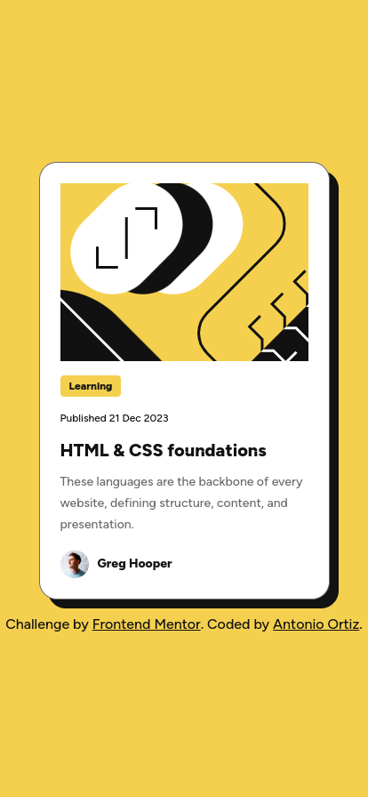

# Frontend Mentor - Blog preview card solution

This is a solution to the [Blog preview card challenge on Frontend Mentor](https://www.frontendmentor.io/challenges/blog-preview-card-ckPaj01IcS). Frontend Mentor challenges help you improve your coding skills by building realistic projects.

## Table of contents

- [Overview](#overview)
  - [The challenge](#the-challenge)
  - [Screenshot](#screenshot)
  - [Links](#links)
- [My process](#my-process)
  - [Built with](#built-with)
  - [What I learned](#what-i-learned)
- [Author](#author)

## Overview

### The challenge

Users should be able to:

- See hover and focus states for all interactive elements on the page

### Screenshot



### Links

- Solution URL: [https://github.com/ortiz-antonio/frontend-mentor/tree/main/challenges/blog-preview-card](https://github.com/ortiz-antonio/frontend-mentor/tree/main/challenges/blog-preview-card)
- Live Site URL: [https://ortiz-antonio.github.io/frontend-mentor/challenges/blog-preview-card/index.html](https://ortiz-antonio.github.io/frontend-mentor/challenges/blog-preview-card/index.html)

## My process

### Built with

- Semantic HTML5 markup
- CSS Variables
- Flexbox
- Mobile-first workflow
- [Normalize.css](https://necolas.github.io/normalize.css/) - CSS Library

### What I learned

The font in the desktop version is slightly different than in the design, but I prefer it this way. By using rem units and adjusting the base font size variable, I was able to maintain the same font proportions.

```@media screen and (min-width: 500px) {
  :root {
    --font-size: 19.1px;
  }

  .card {
    max-width: 336px;
  }
}
```

## Author

- Website - [Antonio Ortiz](https://ortiz.studio)
- Frontend Mentor - [@ortiz-antonio](https://www.frontendmentor.io/profile/ortiz-antonio)
